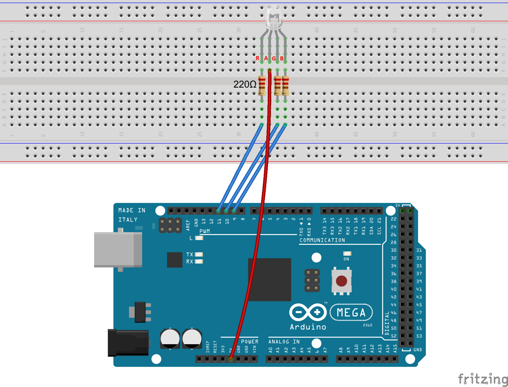
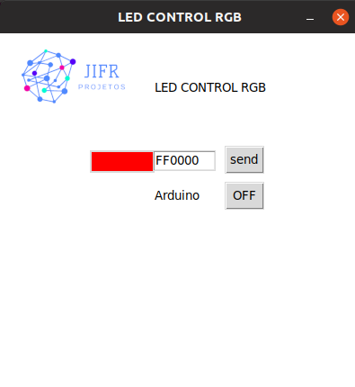

## Controlling a RGB LED by PWM

**Overview**
We will program the Arduino for RGB LED control and have the RGB LED emit various colors of light. Colors will be chosen by a GUI using tkinter.

**Requirement**

- 1* Arduino (MEGA, UNO, NANO)
- 1* USB Cable
- 1* RGB LED
- 3* 220Ω Resistor
- 1* Breadboard
- Several Jumper Wires

**Principle**

RGB LEDs consist of three LEDs. Each LED actually has one red, one green and
one blue light. These three colored LEDs are capable of producing any color.
Tri-color LEDs with red, green, and blue emitters, in general using a four-wire
connection with one common lead (anode or cathode). These LEDs can have
either common anode or common cathode leads.

What we used in this experiment is the common anode RGB LED. The longest
pin is the common anode of three LEDs. The pin is connected to the +5V pin of
the Arduino, and the three remaining pins are connected to the Arduino’s D9,
D10, D11 pins through a current limiting resistor.

In this way we can control the color of the RGB LED by the 3 channel PWM signal. The PWM value is chosen via GUI and sent through the serial port. The function that allows to generate a PWM signal in some of the pins is:

**analogWrite**(PIN, VALUE_ANALOG);
**PIN**: arduino pin number which you want the PWM signal to be generated.
**VALUE_ANALOG**: value (from 0 to 255), proportional to the Duty Cycle to be generated.

The function responsible for reading serial port values sent via GUI is:
**Serial.readString()**: Reads characters from the serial buffer into a String. The function terminates if it times out.

**schematic**

**GUI**

